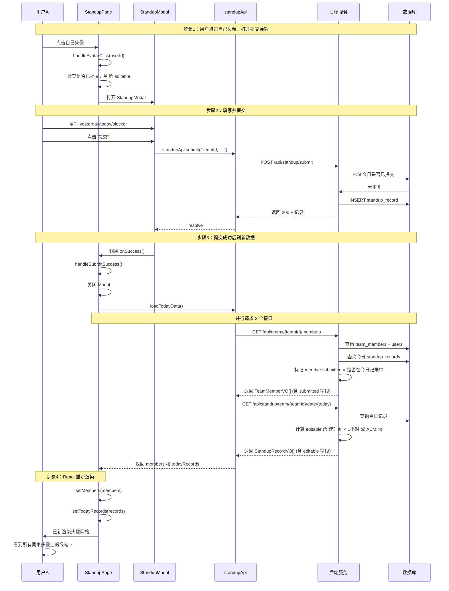

# 站会工具前端架构解析

## 一、路由与页面地图

### 路由配置
文件位置：`frontend/src/App.tsx:11-25`

```
BrowserRouter
├── /login  → LoginPage (登录/注册页)
└── /       → PrivateRoute 守卫
              └── StandupPage (主页，包含今日站会 + 日历回看)
```

### 登录到主页的完整路径

1. **入口文件** `frontend/src/main.tsx:7-13`
   - 用 `BrowserRouter` 包裹整个 App，启用路由功能

2. **首次访问根路径 `/`**
   - `App.tsx:5-9` 的 `PrivateRoute` 组件会检查 `localStorage` 中是否存在 `token`
   - 如果没有 token → 重定向到 `/login`

3. **登录页 `LoginPage`** (`frontend/src/pages/LoginPage.tsx:6-110`)
   - 登录表单提交 → `authApi.login()` → 拿到 token 和用户信息
   - 调用 `useAuth` 的 `saveAuth()` 将 token 和 userInfo 存入 `localStorage`
   - `navigate('/')` 跳转回主页

4. **进入主页 `StandupPage`** (`frontend/src/pages/StandupPage.tsx:9-283`)
   - 通过守卫检查，渲染主页面
   - 自动调用 `loadTeams()` 加载用户所属小组
   - 自动调用 `loadTodayData()` 加载今日成员列表和站会记录

### 页面层级结构（StandupPage）

```
StandupPage
├── Header (顶部导航)
│   ├── Logo + 标题
│   ├── 用户昵称 + 角色标签
│   ├── 小组管理按钮 (仅 ADMIN/LEADER 可见)
│   └── 退出按钮
│
├── 主体内容
│   ├── 小组选择下拉框
│   ├── 视图切换 (今日站会 / 日历回看)
│   │
│   ├── viewMode === 'today'
│   │   ├── 成员头像网格 (可点击提交/编辑)
│   │   └── 今日站会内容列表
│   │
│   └── viewMode === 'calendar'
│       └── CalendarView 组件
│
├── StandupModal (弹窗，提交/编辑站会)
└── TeamManagement (弹窗，小组管理)
```

---

## 二、核心组件职责清单

| 组件/文件 | 路径 | 核心职责 |
|-----------|------|----------|
| **App.tsx** | `frontend/src/App.tsx` | 路由配置、登录守卫 (`PrivateRoute`) |
| **LoginPage** | `frontend/src/pages/LoginPage.tsx` | 登录/注册表单、认证成功后跳转主页 |
| **StandupPage** | `frontend/src/pages/StandupPage.tsx` | 主页容器，管理小组切换、视图模式、成员列表、今日记录状态 |
| **StandupModal** | `frontend/src/components/StandupModal.tsx` | 站会提交/编辑表单弹窗，调用 submit/update API |
| **CalendarView** | `frontend/src/components/CalendarView.tsx` | 日历视图渲染、日期选择、历史记录展示、管理员编辑功能 |
| **TeamManagement** | `frontend/src/components/TeamManagement.tsx` | 小组管理弹窗：查看成员、添加成员、移除成员、创建新小组 |
| **useAuth** | `frontend/src/hooks/useAuth.ts` | 认证状态管理：保存/清除 token 和用户信息、判断角色 |
| **api/index.ts** | `frontend/src/api/index.ts` | API 接口封装：authApi / teamApi / standupApi |
| **utils/request.ts** | `frontend/src/utils/request.ts` | 统一请求封装：自动带 token、401 自动登出、统一错误处理 |

---

## 三、"提交站会 → 头像绿勾亮"的数据流向图



### 关键数据来源说明

**`submitted` 字段**（头像绿勾的依据）：
- 后端：`TeamServiceImpl.getTeamMembers()` (`backend/src/main/java/com/standup/service/impl/TeamServiceImpl.java:134-166`)
- 查询今日的 `standup_record` 表，将 userIds 放入 Set
- 遍历成员时，`vo.setSubmitted(submittedUserIds.contains(user.getId()))`

**`editable` 字段**（编辑权限的依据）：
- 后端：`StandupRecordServiceImpl.convertToVO()` (`backend/src/main/java/com/standup/service/impl/StandupRecordServiceImpl.java:133-173`)
- ADMIN 永远可编辑
- 本人需满足：`hoursSinceCreation < EDIT_WINDOW_HOURS` (1小时)

---

## 四、日历视图数据拉取与渲染

文件位置：`frontend/src/components/CalendarView.tsx:10-164`

### 初始化流程

1. **组件挂载**
   - 计算日期范围：近两周 (today - 13天 到 today)
   - `loadSubmittedDates()` → `standupApi.getSubmittedDates(teamId, startDate, endDate)`
   - 后端查询该日期范围内所有有记录的日期，返回 `List<LocalDate>`
   - 前端存入 `submittedDates` 数组

2. **渲染日历网格**
   - `getDaysInRange()` 生成 14 天的日期数据
   - 每个日期检查：`submittedDates.includes(day.date)` → 显示绿点

3. **点击某一天**
   - `handleDateClick(dateStr)`
   - 调用 `standupApi.getTeamRecordsByDate(teamId, dateStr)`
   - 后端查询该日期的所有站会记录，转换为 VO 时计算 `editable`
   - 前端渲染记录列表

---

## 五、"提交后 1 小时内可编辑"规则的实现

### 前端判断位置

**StandupPage.tsx:67-71**
```typescript
const handleAvatarClick = (userId: number) => {
  if (userId !== userInfo?.userId) return;
  const existing = getMyTodayRecord();
  if (existing) {
    if (existing.editable || isAdmin) {  // ← 前端判断
      setEditingRecord(existing);
      setModalOpen(true);
    }
    return;
  }
  // ...
};
```

**StandupPage.tsx:228-235**（今日记录列表的"编辑"按钮）
```typescript
{record.editable && (
  <button onClick={() => { setEditingRecord(record); setModalOpen(true); }}>
    编辑
  </button>
)}
```

### 后端判断位置

**StandupRecordServiceImpl.java:62-91** (`updateRecord` 方法)
```java
if (isOwner && !isAdmin) {
    long hoursSinceCreation = ChronoUnit.HOURS.between(record.getCreateTime(), LocalDateTime.now());
    if (hoursSinceCreation >= EDIT_WINDOW_HOURS) {
        throw new BizException("提交超过1小时，不能再编辑");
    }
}
```

**StandupRecordServiceImpl.java:162-169** (`convertToVO` 方法，返回 editable 给前端)
```java
if (isAdmin) {
    vo.setEditable(true);
} else if (record.getUserId().equals(currentUserId)) {
    long hoursSinceCreation = ChronoUnit.HOURS.between(record.getCreateTime(), LocalDateTime.now());
    vo.setEditable(hoursSinceCreation < EDIT_WINDOW_HOURS);
} else {
    vo.setEditable(false);
}
```

### 会不会打架或有空子？

**结论：不会打架，前后端双重校验，安全**

| 场景 | 前端表现 | 后端保护 |
|------|----------|----------|
| 提交后 < 1小时 | 显示编辑按钮，可打开弹窗 | updateRecord 放行 |
| 提交后 ≥ 1小时 | 不显示编辑按钮，点击头像也没反应 | updateRecord 抛出异常 |
| ADMIN 角色 | 永远可编辑（前端未显式判断，但后端放行） | updateRecord 跳过时间检查 |

**潜在空子：** 前端仅依赖 `record.editable` 字段判断，后端才是最终防线。即使通过控制台 hack 前端强行打开编辑弹窗，后端也会拒绝超过 1 小时的编辑请求。

---

## 六、最容易埋暗坑的地方

### ⚠️ 暗坑 1：时间精度问题 —— `ChronoUnit.HOURS.between` 的截断行为

**位置**：`backend/src/main/java/com/standup/service/impl/StandupRecordServiceImpl.java:79, 165`

```java
long hoursSinceCreation = ChronoUnit.HOURS.between(record.getCreateTime(), LocalDateTime.now());
```

**问题**：`ChronoUnit.HOURS.between` 返回的是**整数小时差**，会截断小数部分。

例如：
- 创建时间 10:00:00，当前时间 10:59:59 → 返回 0 小时（还能编辑）
- 创建时间 10:00:00，当前时间 11:00:00 → 返回 1 小时（不能编辑了）

**风险**：实际可编辑窗口是 **59分59秒**，而非完整的 1 小时。如果用户 10:00:30 提交，11:00:20 想编辑，已经被拒绝了（差了 10 分钟）。

**建议**：改用分钟判断，或者用 `Duration.between().toHours()` 配合取整策略。

---

### ⚠️ 暗坑 2：前端只读 editable 字段，不感知时间流逝

**位置**：`frontend/src/pages/StandupPage.tsx`

**问题**：`editable` 是后端在查询时计算好返回给前端的**静态值**，前端不会随时间自动更新。

场景：
1. 用户 10:00 提交站会 → 前端拿到 `editable: true`
2. 页面一直开着不刷新
3. 11:30 用户想编辑 → 前端仍然显示编辑按钮（因为没重新拉数据）
4. 点击编辑 → 后端报错"提交超过1小时"

**用户体验差**：按钮明明在，点了却报错。

**建议**：
- 前端也存一份 `createTime`，本地做倒计时判断
- 或者设置一个定时器，到点后自动刷新数据 / 禁用按钮
- 后端错误信息友好提示

---

### ⚠️ 暗坑 3：时区问题

**位置**：前后端多处涉及日期判断

**问题**：
- 后端用 `LocalDate.now()` 和 `LocalDateTime.now()`，依赖服务器时区
- 前端用 `new Date().toISOString().split('T')[0]`，依赖浏览器时区
- 如果服务器和客户端时区不一致，"今日"的定义可能错位

**建议**：统一用 UTC 或明确指定时区，避免跨时区用户在日期边界时出现异常。

---

### ⚠️ 暗坑 4：TeamManagement 中的渲染副作用

**位置**：`frontend/src/components/TeamManagement.tsx:31-33`

```typescript
if (team && !membersLoaded) {
    loadMembers();
}
```

**问题**：这是在渲染函数中直接调用异步函数，违反 React 规则。虽然用了 `membersLoaded` 标志避免重复调用，但：
1. 严格模式下可能执行两次
2. 如果 `team` prop 变化但组件不卸载，不会重新加载

**建议**：改成 `useEffect`：
```typescript
useEffect(() => {
    if (team) loadMembers();
}, [team]);
```
