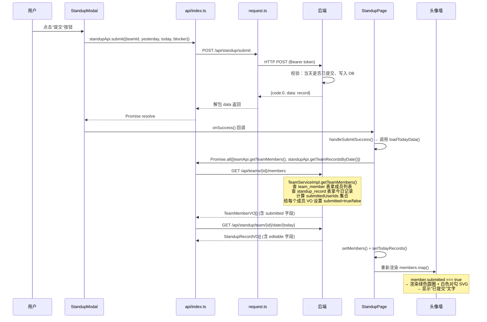

# 站会工具前端架构解析

---

## 一、路由与页面地图

### 1.1 应用入口与路由配置

```
main.tsx
  └─ BrowserRouter
       └─ App.tsx
            ├─ /login  → LoginPage
            └─ /       → PrivateRoute(守卫) → StandupPage
```

**关键文件**：

| 文件 | 职责 |
|------|------|
| `src/main.tsx` | 应用入口，挂载 `BrowserRouter` |
| `src/App.tsx` | 路由定义，包含 `PrivateRoute` 守卫组件 |
| `src/pages/LoginPage.tsx` | 登录/注册页 |
| `src/pages/StandupPage.tsx` | 主页面（唯一一个受保护页面） |

### 1.2 从登录到主页的完整路径

```
1. 用户打开应用 → main.tsx 渲染 <BrowserRouter><App/></BrowserRouter>
2. App 内 <Routes> 匹配当前路径
3. 若路径为 /login → 渲染 LoginPage
   ├─ 登录模式：调用 authApi.login → saveAuth(存 token+userInfo 到 localStorage) → navigate('/') 
   └─ 注册模式：调用 authApi.register → 切回登录模式
4. 若路径为 / → PrivateRoute 检查 localStorage.getItem('token')
   ├─ 无 token → <Navigate to="/login"/> 强制跳转登录页
   └─ 有 token → 渲染 StandupPage
5. StandupPage 挂载后 useEffect 触发 loadTeams() 获取用户所在小组
6. selectedTeam 变化触发 loadTodayData() 并行拉取成员列表+今日记录
```

### 1.3 页面内视图切换

StandupPage 内部不是路由切换，而是用 `viewMode` 状态控制：

```
StandupPage
  ├─ viewMode === 'today'   → 头像墙 + 今日站会内容列表
  └─ viewMode === 'calendar' → CalendarView 日历回看组件
```

此外还有两个浮层：

| 浮层 | 触发条件 |
|------|----------|
| `StandupModal` | 点击自己头像（提交/编辑站会） |
| `TeamManagement` | 管理员/组长点击"小组管理"按钮 |

---

## 二、核心组件职责清单

### 2.1 页面级组件

| 组件 | 文件 | 职责 |
|------|------|------|
| **LoginPage** | `pages/LoginPage.tsx` | 登录/注册表单，切换登录/注册模式；成功后 `saveAuth` 存 localStorage 并 `navigate('/')` |
| **StandupPage** | `pages/StandupPage.tsx` | 主页面，承载全部业务：小组选择、今日视图/日历视图切换、头像墙渲染、站会内容展示、Modal/浮层调度 |

### 2.2 业务组件

| 组件 | 文件 | 职责 |
|------|------|------|
| **StandupModal** | `components/StandupModal.tsx` | 站会记录提交/编辑弹窗；接收 `record` prop 区分新增 vs 编辑模式；调用 `standupApi.submit` 或 `standupApi.update` |
| **CalendarView** | `components/CalendarView.tsx` | 日历回看视图；渲染近 14 天日历网格，标记有记录的日期；点击日期拉取该日记录并展示；内含 `AdminEditModal` 子组件供管理员编辑 |
| **TeamManagement** | `components/TeamManagement.tsx` | 小组管理浮层；查看/添加/移除成员、创建新小组 |

### 2.3 基础设施

| 模块 | 文件 | 职责 |
|------|------|------|
| **useAuth** | `hooks/useAuth.ts` | 认证状态管理 hook；从 localStorage 读取/存储 token 和 userInfo；提供 `saveAuth`、`logout`、`isAdmin`、`isLeader` |
| **api/index.ts** | `api/index.ts` | API 层，封装 authApi / teamApi / standupApi 三个命名空间，所有请求走 `utils/request.ts` |
| **request.ts** | `utils/request.ts` | 请求封装；自动附加 Bearer token；401 时清 localStorage 并跳 /login；统一处理 `{code, data, msg}` 响应格式 |
| **types/index.ts** | `types/index.ts` | TypeScript 类型定义 |

### 2.4 组件嵌套关系图

```
StandupPage
  ├─ <header> 顶栏（用户信息、角色标签、小组管理按钮、退出）
  ├─ 小组选择 <select>
  ├─ 视图切换按钮组（今日站会 / 日历回看）
  ├─ viewMode === 'today' 时：
  │    ├─ 头像墙（members.map → 每个成员卡片含头像、昵称、绿勾）
  │    └─ 今日站会内容列表（todayRecords.map → 记录卡片含编辑按钮）
  ├─ viewMode === 'calendar' 时：
  │    └─ <CalendarView teamId isAdmin>
  │         ├─ 日历网格（14 天，标记已提交日期的绿点）
  │         ├─ 选中日期的记录列表
  │         └─ <AdminEditModal>（管理员编辑浮层，组件内部定义）
  ├─ showTeamMgmt 时：<TeamManagement team isAdmin isLeader>
  └─ modalOpen 时：<StandupModal teamId record onClose onSuccess>
```

---

## 三、"提交站会 → 头像绿勾亮"的数据流向图



### 关键结论

1. **绿勾状态从哪儿来**：后端 `TeamServiceImpl.getTeamMembers()` 方法在返回成员列表时，会查询当天的 `standup_record` 表，把已提交的用户 ID 放进 `submittedUserIds` 集合，然后给每个 `TeamMemberVO` 设置 `submitted` 布尔字段。
2. **在哪儿存**：不存在前端持久化存储里。每次 `loadTodayData()` 调用都是从后端实时拉取，结果存在 React state（`members`）中。
3. **怎么推给页面**：**不是推的，是拉的**。提交成功后 `onSuccess` 回调触发 `loadTodayData()`，重新请求后端接口，拿到最新的 `members` 数据，React 检测到 state 变化后重新渲染头像墙。
4. **同事能不能"立刻"看到**：**不能**。当前架构没有 WebSocket / SSE / 轮询机制。同事的页面上绿勾只在以下时机更新：①同事自己手动刷新页面 ②同事切换了小组又切回来（触发 selectedTeam 变化 → loadTodayData）。这意味着站会场景下多人同时看时，绿勾**不是实时的**。

---

## 四、日历视图如何拉取和渲染历史记录

### 数据流

```
CalendarView 挂载
  → useEffect 触发 loadSubmittedDates()
  → standupApi.getSubmittedDates(teamId, startDate, endDate)
  → GET /api/standup/team/{id}/submitted-dates?startDate=...&endDate=...
  → 后端查 standup_record 表，返回有记录的日期列表 ["2026-05-10", "2026-05-11", ...]
  → setSubmittedDates(dates)
  → 日历网格渲染时判断 submittedDates.includes(day.date) → 有记录的日期显示绿点

用户点击某一天
  → handleDateClick(dateStr)
  → standupApi.getTeamRecordsByDate(teamId, dateStr)
  → GET /api/standup/team/{id}/date/{dateStr}
  → 后端返回 StandupRecordVO[]（含 editable 字段）
  → setRecords(data)
  → 渲染该天的记录卡片列表
```

### 关键细节

- 日历只展示**近 14 天**（`twoWeeksAgo` 到 `today`），不是完整月份视图
- `submittedDates` 只返回**日期字符串列表**，不含具体内容——这是轻量级查询，只查 `record_date` 列
- 具体记录内容在用户点击日期后才拉取，属于懒加载
- 日历视图中的 `editable` 字段由后端 `convertToVO` 方法计算：管理员永远 `editable=true`，本人 1 小时内 `editable=true`，其余 `false`

---

## 五、"1 小时可编辑"规则的前后端判断分析

### 5.1 后端判断逻辑（权威来源）

位于 `StandupRecordServiceImpl.java`：

**提交时**（`submit` 方法，第 34-59 行）：
- 检查当天同用户同小组是否已有记录，有则抛异常 "今天已经提交过站会记录"

**更新时**（`updateRecord` 方法，第 62-91 行）：
- 权限校验：只有记录本人或管理员可编辑
- 时间校验（第 78-83 行）：如果是本人（非管理员），计算 `ChronoUnit.HOURS.between(record.getCreateTime(), LocalDateTime.now())`，若 >= 1 则抛异常 "提交超过1小时，不能再编辑"
- **管理员不受 1 小时限制**

**查询时**（`convertToVO` 方法，第 133-173 行）：
- 给 `StandupRecordVO.editable` 字段赋值
- 管理员：`editable = true`
- 本人：`editable = hoursSinceCreation < 1`
- 他人：`editable = false`

### 5.2 前端判断逻辑

前端**没有自己做时间判断**，完全依赖后端返回的 `editable` 字段：

1. **头像点击**（`StandupPage.tsx` 第 64-76 行）：点击自己头像时，如果已有记录且 `existing.editable` 为 `true`（或 `isAdmin`），才打开编辑弹窗
2. **编辑按钮**（`StandupPage.tsx` 第 228-235 行）：记录卡片上的"编辑"按钮只在 `record.editable` 为 `true` 时渲染
3. **日历视图**（`CalendarView.tsx` 第 121 行）：管理员编辑按钮只在 `record.editable && isAdmin` 时显示

### 5.3 前后端是否会打架

**不会打架**——前端是纯 UI 层判断（控制按钮是否显示），后端是真正的安全校验。即使前端绕过 UI 限制直接调 API，后端也会拦截。

### 5.4 但是有一个空子 ⚠️

后端时间校验用的是 `ChronoUnit.HOURS.between()`，这个方法是**整小时截断**：

```java
// 例如 createTime = 10:30, now = 11:29
// ChronoUnit.HOURS.between → 0 (< 1, 可编辑 ✓)
// 实际已经过了 59 分钟

// 例如 createTime = 10:30, now = 11:31
// ChronoUnit.HOURS.between → 1 (>= 1, 不可编辑 ✗)
```

这意味着**实际可编辑窗口接近 2 小时**（最短 1 小时 1 秒，最长 1 小时 59 分 59 秒）。如果产品要求精确的 1 小时截止，应该改用 `ChronoUnit.MINUTES.between() >= 60`。

另一个空子：前端拿到的 `editable` 是查询那一刻的计算结果，如果用户在 59 分钟时打开了编辑弹窗、在第 61 分钟才点保存，前端不会阻止，后端此时才会拒绝。**体验上用户会觉得"我明明可以编辑怎么突然报错了"**。

---

## 六、容易踩坑的地方

### 🕳️ 坑 1：绿勾不是实时的——站会场景核心痛点

**现状**：提交站会后，只有自己的页面会刷新数据，同事的页面不会更新。

**场景**：站会上大家同时盯着屏幕，A 提交了但 B 看到A的头像还是灰的，B 以为 A 还没提交，催 A 交。A 说我交了啊。于是 A 和 B 都困惑。

**根因**：前端没有任何实时推送机制（无 WebSocket / SSE / 轮询），数据更新完全依赖用户主动触发（切换小组、刷新页面）。

**建议**：
- 最小方案：加 `setInterval` 每 30 秒轮询 `loadTodayData()`
- 中等方案：监听 `document.visibilitychange`，切回标签页时自动刷新
- 完整方案：后端加 WebSocket/SSE 推送

### 🕳️ 坑 2：PrivateRoute 只检查 token 是否存在，不验证有效性

**现状**：`App.tsx` 第 6-8 行，`PrivateRoute` 只看 `localStorage.getItem('token')` 是否有值，不管 token 是否过期。

**场景**：用户登录后 token 过期（比如后端 JwtUtil 有过期时间），但 localStorage 里还存着旧 token。用户进入主页后所有 API 请求都会 401 → 被 `request.ts` 拦截跳回登录页。**用户体验是：先看到主页，然后突然被踢回登录页**。

**建议**：PrivateRoute 中加一个 API 调用（如 `userApi.getMe()`）验证 token 有效性，无效则直接跳登录页，避免"闪一下主页再踢走"。

### 🕳️ 坑 3：TeamManagement 的 loadMembers 在渲染中触发

**现状**：`TeamManagement.tsx` 第 31-33 行，在组件函数体中直接判断 `if (team && !membersLoaded) { loadMembers(); }`，这是在渲染阶段触发副作用。

**风险**：React 严格模式下渲染函数可能被执行两次，导致 `loadMembers` 被调用两次。当前项目已启用 `<React.StrictMode>`（`main.tsx` 第 8 行），开发环境下必现双调用。

**建议**：改用 `useEffect` 触发数据加载。

### 🕳️ 坑 4：日历视图的 submittedDates 不区分用户

**现状**：`getSubmittedDates` 返回的是该小组在某日期"有人提交"的日期列表，不区分是哪个用户提交的。

**场景**：日历上的绿点只表示"这一天团队有人交过"，点击后才能看到具体谁交了。这不是 bug，但可能让用户误以为"绿点=全员都交了"。

**建议**：如果绿点的语义需要更精确，可以改为返回 `{date: string, count: number}` 格式，前端按人数/总人数渲染不同状态。

### 🕳️ 坑 5：前端 editable 状态可能在编辑过程中过期

**现状**：用户在 59:59 时打开编辑弹窗，1:00:01 时点保存——前端 UI 显示可编辑，但后端校验已过期。

**体验问题**：用户困惑——"我明明点的是编辑，怎么提示超时了？"

**建议**：在 StandupModal 中加一个倒计时提示（如果距离不可编辑不到 2 分钟，显示倒计时）；或者前端也做一次时间估算，在即将过期时给出警告。

### 🕳️ 坑 6：退出登录只清了前端，没有通知后端

**现状**：`useAuth.logout()` 只清 localStorage，没有调后端登出接口。

**风险**：如果后端未来加了 token 黑名单/主动失效机制，当前的 logout 不会通知后端把 token 作废，旧 token 在过期前仍然可用。
