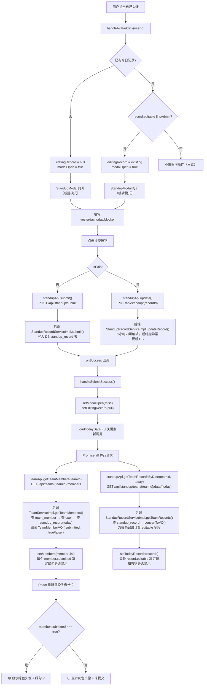

# 站会工具前端架构全解

## 一、路由与页面地图

### 1.1 路由配置

路由定义在 `frontend/src/App.tsx`，全局只有两条路由：

| 路径 | 组件 | 守卫 |
|------|------|------|
| `/login` | `LoginPage` | 无（未登录才需要） |
| `/` | `StandupPage` | `PrivateRoute`（检查 localStorage 中的 token） |

应用入口在 `main.tsx`，用 `BrowserRouter` 包裹 `App`，即整个应用为 SPA 客户端路由。

### 1.2 登录页 → 主页路径

```
用户打开应用
  └─ BrowserRouter 匹配 "/"
       └─ PrivateRoute 检查 localStorage.getItem('token')
            ├─ 无 token → <Navigate to="/login" />  → LoginPage
            │                                              │
            │    用户输入账号密码 → authApi.login()          │
            │         ↓                                     │
            │    后端返回 { token, userId, nickname, role }  │
            │         ↓                                     │
            │    saveAuth() 写入 localStorage               │
            │         ↓                                     │
            │    navigate('/') → 重走 PrivateRoute          │
            │         ↓                                     │
            │    token 存在 → 渲染 StandupPage ✓            │
            │                                                │
            └─ 有 token → 直接渲染 StandupPage ✓
```

**关键细节：**

- **认证信息存哪**：`localStorage`，键名 `token` 和 `userInfo`。`useAuth` hook 在初始化时从 localStorage 恢复状态。
- **token 怎么带上去**：`utils/request.ts` 里的 `request()` 函数每次发请求都从 `localStorage.getItem('token')` 取 token，放到 `Authorization: Bearer xxx` 头。
- **401 怎么处理**：`request.ts:32` 一旦收到 401，立刻清空 localStorage 并 `window.location.href = '/login'` 硬跳转（非 React Router navigate，会刷新整个页面）。
- **PrivateRoute 的局限**：只检查 token 是否存在，**不验证 token 是否过期**。如果 token 过期但还留在 localStorage 里，页面会进入 StandupPage，但第一个 API 调用就会 401 被踢回登录页。

### 1.3 页面嵌套结构图

```
<main.tsx>
  └─ <BrowserRouter>
       └─ <App>
            ├─ /login → <LoginPage>
            │
            └─ / → <PrivateRoute>
                 └─ <StandupPage>  ← 唯一主页面
                      ├─ <header> 顶部导航栏（昵称、角色标签、小组管理按钮、退出）
                      │
                      ├─ <main> 主内容区
                      │    │
                      │    ├─ [无团队] → 空状态提示 + 创建小组按钮
                      │    │
                      │    └─ [有团队] →
                      │         ├─ 团队选择 <select>
                      │         ├─ 视图切换按钮：今日站会 / 日历回看
                      │         │
                      │         ├─ viewMode === 'today' →
                      │         │    ├─ 成员头像卡片列表（含绿勾）
                      │         │    └─ 今日站会内容详情列表
                      │         │
                      │         └─ viewMode === 'calendar' →
                      │              └─ <CalendarView teamId isAdmin>
                      │                   ├─ 14天日历网格（绿点标记有提交的日期）
                      │                   ├─ 选中日期的记录列表
                      │                   └─ <AdminEditModal>（管理员编辑弹窗）
                      │
                      ├─ {showTeamMgmt} → <TeamManagement team onClose isAdmin isLeader>
                      │
                      └─ {modalOpen} → <StandupModal teamId record onClose onSuccess>
```

---

## 二、核心组件职责清单

| 组件 | 文件路径 | 职责 | 关键状态 | 依赖的 API |
|------|----------|------|----------|------------|
| **App** | `App.tsx` | 路由定义 + PrivateRoute 守卫 | 无 | 无 |
| **LoginPage** | `pages/LoginPage.tsx` | 登录/注册表单，登录成功后 saveAuth + navigate('/') | `username, password, isRegister, nickname, error, loading` | `authApi.login`, `authApi.register` |
| **StandupPage** | `pages/StandupPage.tsx` | 主页面：加载团队列表、加载今日数据、渲染头像卡片区、渲染记录列表、调度子组件 | `teams, selectedTeam, members, todayRecords, modalOpen, editingRecord, viewMode, showTeamMgmt` | `teamApi.getMyTeams`, `teamApi.getTeamMembers`, `standupApi.getTeamRecordsByDate` |
| **StandupModal** | `components/StandupModal.tsx` | 提交/编辑站会记录的弹窗表单（昨天/今天/阻塞三项） | `yesterday, today, blocker, loading, error` | `standupApi.submit`, `standupApi.update` |
| **CalendarView** | `components/CalendarView.tsx` | 日历回看视图：渲染近14天日历网格、点击日期拉记录、内嵌 AdminEditModal | `submittedDates, selectedDate, records, editRecord` | `standupApi.getSubmittedDates`, `standupApi.getTeamRecordsByDate` |
| **TeamManagement** | `components/TeamManagement.tsx` | 小组管理弹窗：展示成员列表、添加/移除成员、创建新小组 | `members, addUsername, newTeamName, loading, error, membersLoaded` | `teamApi.getTeamMembers`, `teamApi.addMember`, `teamApi.removeMember`, `teamApi.createTeam` |
| **useAuth** | `hooks/useAuth.ts` | 认证状态管理 hook：提供 userInfo / saveAuth / logout / isAdmin / isLeader | `userInfo`（从 localStorage 初始化） | 无直接 API 调用 |
| **request** | `utils/request.ts` | 统一 HTTP 请求封装：自动带 token、401 处理、统一响应解包 | 无 | 底层 fetch |

---

## 三、"提交站会 → 头像绿勾亮"的数据流向图

> **核心发现：这个项目没有 WebSocket / SSE / 轮询等实时推送机制。同事头像上的绿勾"立刻"看到，是因为你自己提交后调用了 `loadTodayData()` 刷新了整个成员列表和记录列表——但你同事的页面并不会自动刷新。**



### 绿勾数据来源详解

| 环节 | 位置 | 说明 |
|------|------|------|
| **绿勾的显示条件** | `StandupPage.tsx:180` | `const submitted = member.submitted;`，为 true 时渲染绿勾 SVG |
| **submitted 从哪来** | `TeamMemberVO` 类型定义，`types/index.ts:40` | 后端 `GET /api/teams/{teamId}/members` 返回的字段 |
| **后端怎么算 submitted** | `TeamServiceImpl.java:146-155` | 查 `standup_record` 表中 `teamId + recordDate=today` 的记录，提取已提交的 userId 集合，`submittedUserIds.contains(user.getId())` |
| **刷新时机** | `StandupPage.tsx:86` | `handleSubmitSuccess → loadTodayData()` 重新拉取 members + records |
| **实时性** | ❌ **无实时推送** | 同事不会自动看到你的绿勾，必须手动刷新页面（切换团队或刷新浏览器） |

---

## 四、日历视图渲染流程

```
CalendarView 组件挂载
  │
  ├─ 计算 startDate（14天前）、endDate（今天）
  │
  ├─ useEffect → loadSubmittedDates()
  │    └─ GET /api/standup/team/{teamId}/submitted-dates?startDate=...&endDate=...
  │         └─ 后端查 standup_record 表，返回有记录的日期列表 ["2025-05-01", "2025-05-03", ...]
  │              └─ setSubmittedDates(dates)
  │                   └─ 日历格子中有记录的日期显示绿色小圆点
  │
  ├─ 用户点击某个日期格子
  │    └─ handleDateClick(dateStr)
  │         └─ GET /api/standup/team/{teamId}/date/{dateStr}
  │              └─ 后端返回 List<StandupRecordVO>（含 editable 字段）
  │                   └─ setRecords(data)
  │                        └─ 渲染该日的站会记录列表
  │
  └─ 管理员点击"管理员编辑"按钮
       └─ 内嵌 AdminEditModal
            └─ PUT /api/standup/{recordId}
                 └─ 成功后关闭弹窗（注意：没有刷新 submittedDates）
```

**日历视图的数据拉取是懒加载模式**：先只拉日期列表画小圆点，用户点击具体日期才拉该日的详细记录。

---

## 五、"1小时可编辑"规则的前端判断与后端校验

### 5.1 前端在哪判断

前端**不直接判断 1 小时规则**，而是依赖后端返回的 `editable` 字段：

| 场景 | 前端代码位置 | 判断方式 |
|------|-------------|----------|
| 今日站会 - 编辑按钮显示 | `StandupPage.tsx:228` | `record.editable &&` → 显示"编辑"按钮 |
| 点击头像 - 是否可打开编辑 | `StandupPage.tsx:68` | `existing.editable || isAdmin` → 可打开 modal |
| 日历回看 - 管理员编辑按钮 | `CalendarView.tsx:121` | `record.editable && isAdmin` → 显示"管理员编辑" |
| StandupModal - 无额外判断 | `StandupModal.tsx` | modal 本身不做 editable 检查，由调用方控制是否打开 |

### 5.2 后端在哪判断

`StandupRecordServiceImpl.java`:

- **`convertToVO()` 方法**（`第162-169行`）：计算 `editable` 字段
  - 管理员 → `editable = true`（始终可编辑）
  - 记录所有者 → `hoursSinceCreation < 1` → `editable = true`，否则 `false`
  - 非所有者非管理员 → `editable = false`

- **`updateRecord()` 方法**（`第78-83行`）：实际修改时的二次校验
  - 所有者非管理员 → `hoursSinceCreation >= 1` → 抛 `BizException("提交超过1小时，不能再编辑")`
  - 管理员 → 跳过时间校验

### 5.3 前后端是否打架？有没有空子？

| 风险点 | 分析 | 严重程度 |
|--------|------|----------|
| **editable 字段的"快照"问题** | `editable` 是拉取数据那一刻算出来的。如果用户在 59 分 50 秒时打开了页面（此时 `editable=true`），然后在 1 小时 5 分后点编辑提交，前端不会拦，但**后端会拦**（`updateRecord` 二次校验）。用户会看到报错弹窗，不会造成数据错误。 | ⚠️ 低——体验不好但不丢数据 |
| **管理员 editable 始终为 true** | 前端日历视图中 `CalendarView.tsx:121` 用 `record.editable && isAdmin` 双重判断，看起来安全。但 `StandupPage.tsx:68` 中 `existing.editable || isAdmin` 是用 OR，管理员即使 `editable=false` 也能打开编辑——这其实是正确的，因为后端对管理员没有时间限制。 | ✅ 一致 |
| **前端不主动计时** | 没有"倒计时 1 小时"机制。用户可能一直开着页面，editable 状态不会自动从 true 变 false。切换团队或刷新才会重新拉取。 | ⚠️ 中——用户可能以为还能编辑 |
| **直接调 API 绕过前端** | 前端隐藏了按钮但没做提交时的前端校验。不过后端有 `updateRecord` 的二次校验，所以**直接调 API 也绕不过去**。 | ✅ 安全 |

**结论**：前后端在"1 小时"规则上整体一致，后端有兜底校验不会被打穿。但前端缺少主动计时/轮询机制，用户长时间不刷新时会出现"按钮还在但提交被拒"的体验问题。

---

## 六、⚠️ 我担心会踩坑的地方

### 🕳️ 坑 1：绿勾不是实时的——多人协作场景下的"伪同步"

**问题本质**：项目没有任何实时推送（无 WebSocket / SSE / 轮询），绿勾状态完全依赖当前用户自己操作后触发的 `loadTodayData()` 刷新。

**踩坑场景**：
- 站会时间到，5 个人同时打开页面，每个人看到的都是"全员未提交"
- A 提交了，A 的页面绿勾亮了，但 B/C/D/E 看到的 A 仍然是"未提交"
- 如果 B 以为 A 没提交就一直等，实际上 A 早就提交了

**风险等级**：🔴 高——这直接违背了站会工具"让大家看到谁提交了"的核心需求。

**建议方向**：
- 最简方案：在 StandupPage 加一个 `setInterval` 每 30 秒调一次 `loadTodayData()`
- 更优方案：引入 WebSocket，后端在有人提交时广播消息
- 折中方案：使用 `visibilitychange` 事件，用户切回标签页时自动刷新

---

### 🕳️ 坑 2：`editable` 状态是快照，不会自动过期

**问题本质**：`editable` 在 API 返回时就定死了，前端没有任何机制让它在页面上"过期"。

**踩坑场景**：
- 用户 9:00 提交站会，`editable=true`
- 用户 9:55 打开编辑弹窗（还没提交），去喝了杯咖啡
- 10:05 回来点击保存 → 后端拒绝 → 用户困惑"明明编辑框还开着啊"

**风险等级**：🟡 中——不会丢数据，但用户体验差，可能被认为"Bug"。

**建议方向**：
- 在 `StandupModal` 打开时记录打开时间，提交前做一个前端二次校验（对比 `createTime` 和当前时间）
- 或者加一个 visible 的倒计时提示："还剩 XX 分钟可编辑"

---

### 🕳️ 坑 3：CalendarView 的 AdminEditModal 保存后不刷新数据

**问题本质**：`CalendarView.tsx:173-188` 的 `AdminEditModal.handleSave()` 成功后只调 `onClose()`，**不刷新 records 列表也不刷新 submittedDates**。

**踩坑场景**：
- 管理员在日历视图打开某天的记录，编辑了 A 的内容
- 保存后弹窗关闭，但下方显示的记录内容还是编辑前的旧数据
- 管理员以为没保存成功，又点编辑再提交一次

**风险等级**：🟡 中——数据实际已保存，但 UI 不一致。

**建议方向**：`AdminEditModal.handleSave` 成功后应调用 `handleDateClick(selectedDate!)` 重新拉取当天记录。

---

### 🕳️ 坑 4：PrivateRoute 只检查 token 存在性，不验证有效性

**问题本质**：`App.tsx:6-9` 的 `PrivateRoute` 只看 `localStorage.getItem('token')` 是否有值，不检查 token 是否过期。

**踩坑场景**：
- 用户昨天登录后关了浏览器
- 今天打开，token 还在 localStorage 里（JWT 可能已过期）
- 页面进入 StandupPage，开始渲染
- 第一个 API 请求触发 401 → `window.location.href = '/login'` 硬刷新
- 用户看到页面闪了一下才跳登录页

**风险等级**：🟡 中——功能不受影响，但体验不好，页面会闪烁。

**建议方向**：
- 在 PrivateRoute 中尝试解析 JWT 的 exp 字段做前端过期检查
- 或者在 App 层加一个 `/user/me` 的预检请求，失败则直接跳登录

---

### 🕳️ 坑 5：useAuth 状态不同步

**问题本质**：`useAuth` hook 的 `userInfo` 是 React state，但 token 存在 localStorage。多个组件同时使用 `useAuth` 时，每个组件拿到的是**各自独立的 state 实例**，不是共享的。

**踩坑场景**：
- 如果未来添加更多页面/组件，分别在各自作用域调用 `useAuth()`
- 某个组件调用 `logout()` 清空了自己的 state + localStorage
- 另一个组件的 `userInfo` state 仍然是旧值（React 不会跨组件自动同步 state）
- 该组件仍然以为用户已登录，可能发出带过期 token 的请求

**风险等级**：🟡 中——当前只有 StandupPage 一个主页面，问题暂不明显。一旦页面增多会暴露。

**建议方向**：将 auth 状态提升到 Context（`AuthContext`），或使用 Zustand/Jotai 等状态管理库。

---

### 🕳️ 坑 6：`ChronoUnit.HOURS.between` 精度丢失

**问题本质**：`StandupRecordServiceImpl.java:79` 用 `ChronoUnit.HOURS.between()` 计算时间差，这是**截断取整**而非四舍五入。1 小时 59 分钟的结果是 `1`，刚好不触发 `>= EDIT_WINDOW_HOURS` 的拦截。

**踩坑场景**：
- 9:00 提交，10:59 编辑 → `hoursSinceCreation = 1` → `1 >= 1` → **拦截** ✅
- 9:00 提交，10:01 编辑 → `hoursSinceCreation = 1` → `1 >= 1` → **拦截** ✅
- 9:00 提交，9:59 编辑 → `hoursSinceCreation = 0` → `0 >= 1` → **放行** ✅
- 9:00 提交，10:00:01 编辑 → `hoursSinceCreation = 1` → `1 >= 1` → **拦截** ✅

实际上 `HOURS.between` 的行为是"满 1 小时才算 1"，所以 9:00→10:00 刚好 1 小时会被拦截，看起来是"1 小时内可编辑，过了就只读"。

但如果用户理解为"1 小时内"是 3600 秒，那 9:00:00 提交、10:00:00 编辑被拦会觉得"刚好 1 小时为什么不行？"。这是**边界理解歧义**——规则说的是"超过 1 小时"，`>=` 判断意味着恰好 1 小时时已不可编辑。

**风险等级**：🟢 低——边界值理解问题，可文档说明。

**建议方向**：如果想"1 小时内"包含恰好 1 小时，改为 `> EDIT_WINDOW_HOURS`；或改用 `MINUTES.between` 做更精确的 60 分钟判断。
