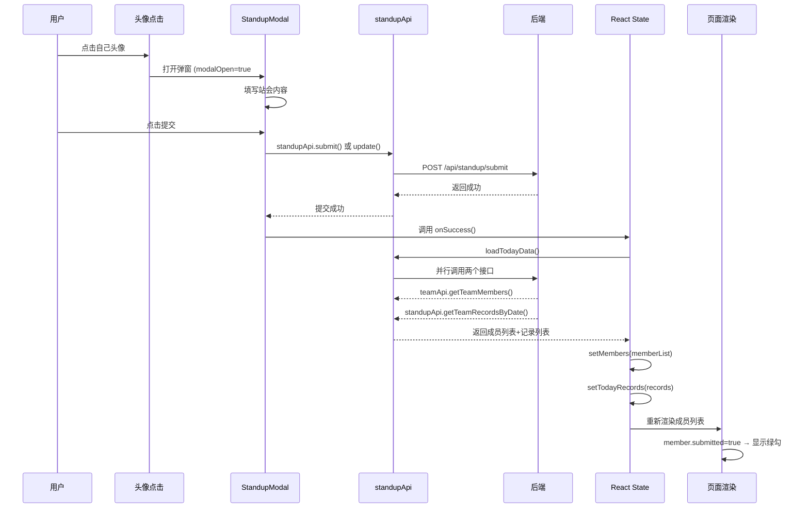

# 站会工具前端分析文档

## 路由与页面地图

### 路由配置（App.tsx:11-24）

应用使用 `react-router-dom` 进行路由管理，整体路由结构非常简洁：

```
/login  →  LoginPage (登录/注册页面)
/      →  StandupPage (主页面，需要登录)
```

**登录验证流程：
1. 打开应用 → BrowserRouter 包裹整个应用（main.tsx:7-12）
2. 访问 `/` 路径 → 触发 `PrivateRoute` 组件检查
3. 检查 `localStorage` 中是否有 `token`
   - 有 token → 渲染 StandupPage（主页）
   - 无 token → 重定向到 `/login`（登录页）

**登录成功后跳转流程：**
1. 用户在 LoginPage 填写用户名密码
2. 调用 `authApi.login()` 发起登录请求
3. 登录成功后调用 `saveAuth(data)` 保存 token 和用户信息到 localStorage
4. `navigate('/')` 跳转到主页

---

## 核心组件职责清单

### 页面级组件

| 组件 | 文件路径 | 核心职责 |
|------|----------|----------|
| **LoginPage** | `pages/LoginPage.tsx` | 登录/注册表单、调用认证接口、跳转主页 |
| **StandupPage** | `pages/StandupPage.tsx` | 主页容器、团队切换、今日/日历视图切换、成员头像列表、站会记录展示 |

### 功能组件

| 组件 | 文件路径 | 核心职责 |
|------|----------|----------|
| **StandupModal** | `components/StandupModal.tsx` | 站会提交/编辑弹窗、表单提交、调用提交/更新接口 |
| **CalendarView** | `components/CalendarView.tsx` | 日历视图、近两周日期展示、日期点击加载记录、管理员编辑功能 |
| **TeamManagement** | `components/TeamManagement.tsx` | 团队管理弹窗、成员列表、添加/移除成员、创建新团队 |

### Hooks

| Hook | 文件路径 | 核心职责 |
|------|----------|----------|
| **useAuth** | `hooks/useAuth.ts` | 认证状态管理、保存/清除登录信息、角色判断 |

### 工具与API

| 模块 | 文件路径 | 核心职责 |
|------|----------|----------|
| **request** | `utils/request.ts` | HTTP 请求封装、token 注入、401 自动跳转登录、统一错误处理 |
| **api** | `api/index.ts` | API 接口封装（auth、user、team、standup） |

### 组件嵌套关系

```
StandupPage (主页)
├── Header (顶部导航)
│   ├── 用户信息展示
│   ├── 小组管理按钮 (管理员/组长可见)
│   └── 退出按钮
├── 团队选择下拉框
├── 视图切换 (今日/日历)
├── 今日视图
│   ├── 成员头像列表 (带绿勾状态)
│   └── 今日站会记录列表
├── 日历视图 (CalendarView)
│   ├── 近两周日历网格
│   └── 选中日期的记录列表
├── 团队管理弹窗 (TeamManagement)
└── 站会提交/编辑弹窗 (StandupModal)
```

---

## "提交站会 → 头像绿勾亮"的数据流向图



**关键细节说明：**

1. **状态来源**：`TeamMemberVO.submitted` 字段来自后端 `getTeamMembers` 接口，不是前端根据当天是否有记录来判断
2. **实时性实现**：提交成功后立即调用 `loadTodayData()` 重新拉取数据，通过重新渲染实现"实时"更新（注意：这是**轮询式刷新**，不是 WebSocket 推送）
3. **判断逻辑**：`StandupPage.tsx:180` - 根据 `member.submitted` 控制绿勾显示

---

## 日历视图数据拉取与渲染

**日历视图渲染流程：**

1. **组件初始化**（CalendarView.tsx:32-34）
   - 计算近两周日期范围（startDate ~ endDate）
   - 调用 `standupApi.getSubmittedDates()` 获取有记录的日期列表
   - 渲染日历网格，有记录的日期显示绿点

2. **点击日期**（CalendarView.tsx:36-44）
   - 调用 `standupApi.getTeamRecordsByDate(teamId, dateStr)`
   - 获取该日期所有团队成员的站会记录
   - 渲染记录列表

3. **历史记录编辑权限**：
   - 后端返回 `StandupRecordVO.editable` 字段
   - 管理员始终可编辑（CalendarView.tsx:121）
   - 普通用户：提交后1小时内可编辑（由后端判断）

---

## "1小时可编辑"规则实现

### 前端判断位置

**前端判断**（StandupPage.tsx:68）：
```typescript
if (existing.editable || isAdmin) {
  setEditingRecord(existing);
  setModalOpen(true);
}
```

**后端判断**（StandupRecordServiceImpl.java:78-83）：
```java
if (isOwner && !isAdmin) {
    long hoursSinceCreation = ChronoUnit.HOURS.between(record.getCreateTime(), LocalDateTime.now());
    if (hoursSinceCreation >= EDIT_WINDOW_HOURS) {
        throw new BizException("提交超过1小时，不能再编辑");
    }
}
```

### 前后端双重校验分析

| 校验层级 | 位置 | 作用 |
|---------|------|------|
| **前端** | StandupPage.tsx:68 | 控制"编辑"按钮显示/隐藏，提升用户体验 |
| **后端** | StandupRecordServiceImpl.java:78-83 | 真正的权限校验，防止恶意调用 |

**会不会打架或有空子？**

✅ **不会打架**：前后端判断逻辑一致，都是基于 `createTime` 计算小时数

⚠️ **存在潜在问题**：
- 前端依赖后端返回的 `editable` 字段，该字段在查询时计算
- 如果用户停留在页面超过1小时，`editable` 不会实时更新
- 用户可能看到"编辑"按钮但点击后被后端拒绝（体验问题，但安全没问题）

---

## 你担心会踩坑的地方

### ❗️ **暗坑 1：前端 editable 状态不会实时更新

**位置**：`StandupRecordVO.editable 字段

**问题描述**：
- 后端在查询记录时计算 `editable` 字段返回给前端
- 前端拿到后存入 `todayRecords` state 中就固定了
- 如果用户打开页面后停留超过1小时，`editable` 还是 `true`
- 用户点击"编辑"按钮会被后端拒绝

**影响**：用户体验差，能看到按钮但点了报错

**建议修复**：前端也做一次时间判断，或定时刷新

---

### ❗️ **暗坑 2：TeamManagement 组件的副作用在渲染中执行

**位置**：`TeamManagement.tsx:31-33`

```typescript
if (team && !membersLoaded) {
  loadMembers();
}
```

**问题描述**：
- 这是在函数组件的渲染主体中直接调用异步函数
- 违反 React 规范，可能导致多次请求或无限循环
- 正确做法应该放在 `useEffect` 中

**风险**：
- 可能重复发起重复请求
- React 严格模式下会执行两次
- 未来 React 版本可能出问题

**建议修复**：用 `useEffect` 包裹

---

### ❗️ **暗坑 3：日期处理的时区问题

**位置**：多处使用 `new Date().toISOString().split('T')[0]`

**问题描述**：
- `toISOString()` 返回 UTC 时间
- 北京时间晚上8点后，UTC 还是前一天
- 导致跨天时报错"今天已经提交过"或记录日期错误

**影响**：夜班/海外用户会遇到日期错乱

**建议**：使用 `date-fns` 或 `dayjs` 等库正确处理时区
